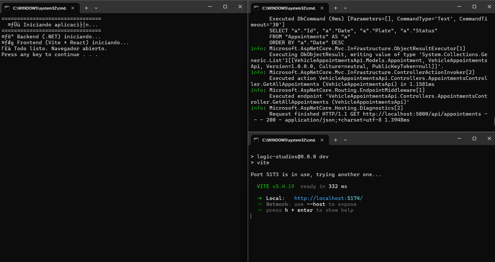
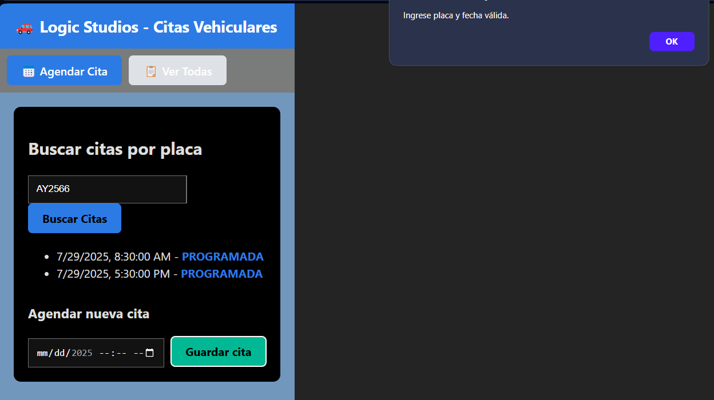
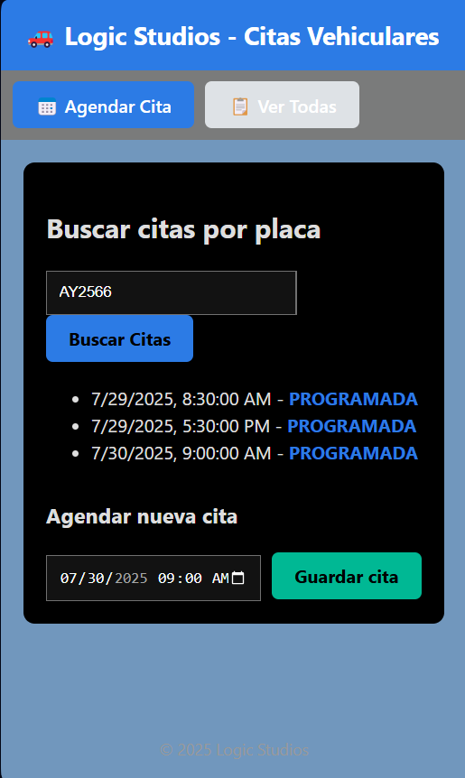
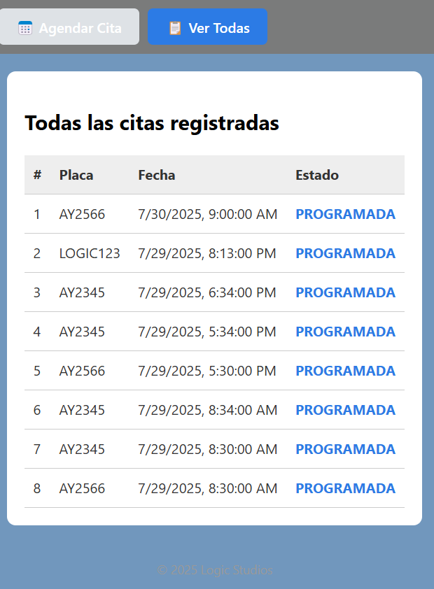
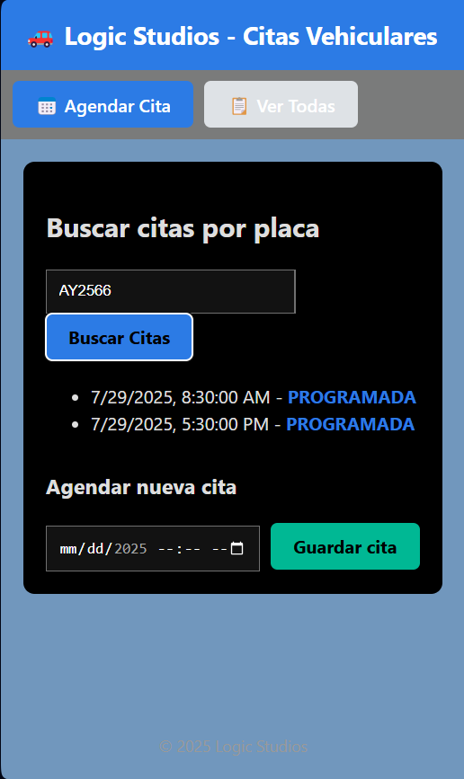
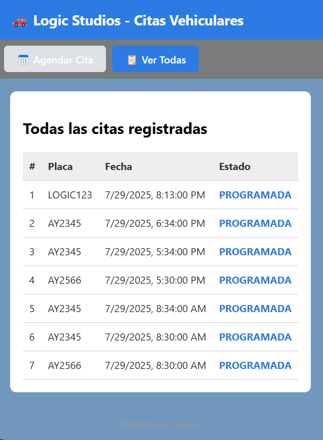

# 🚗 Vehicle Appointment Manager

Aplicación web para agendar y visualizar citas de mantenimiento de vehículos. Desarrollada con React (frontend) y ASP.NET Core (.NET 6) como backend, usando SQLite como base de datos liviana.

---

## 🧰 Tecnologías utilizadas

- 🔧 Backend: ASP.NET Core (.NET 6)
- 💻 Frontend: React + Vite
- 🗃️ Base de datos: SQLite
- 🎯 Arquitectura: API REST con layout modular

---

## 📸 Capturas de pantalla

### 📅 Ejecutable 2.run.bat



### 📅 Agendar cita





---

### 🔍 Buscar por placa



---

### 📋 Ver todas las citas




---

## 🚀 Cómo ejecutar el proyecto

### 1. Clona el repositorio

```bash
git clone https://github.com/RobertoRodriguezP/formulariocapturainformacion.git
cd tu-repo
```

### 2. Utilizar 

```bash 
1.setup.bat
2.run.bat

```

### 3. Run.bat

